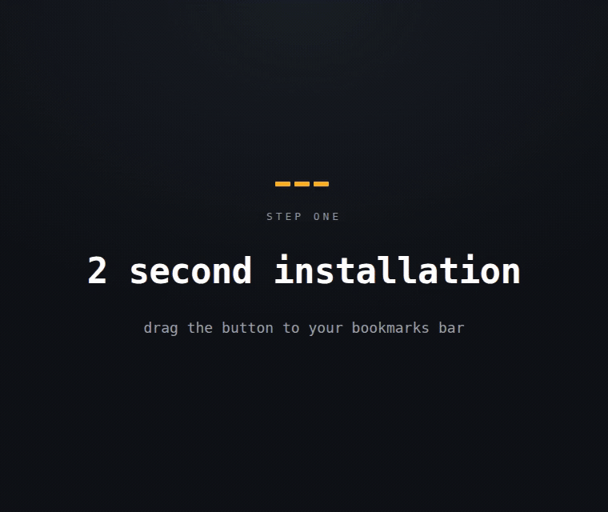

# AI Web Capture

A bookmarklet for grabbing feedback straight off a web page — pick an element, write a note, and it's saved as Markdown (with a screenshot) or dropped straight into a GitHub issue. No browser extension, no install beyond dragging a button to your bookmarks bar.

**Install:** https://philter87.github.io/ai-web-capture/

Free forever. Works in Chrome, Edge, and Brave on desktop. It relies on the File System Access API to write captures to a folder, so it does **not** work on mobile devices or in Safari — the install page shows a walkthrough for those cases.

## How it works

1. Drag the **AI Web Capture** button to your bookmarks bar.
2. Click it on any page — a small panel appears bottom right.
3. Pick an element, write a description, and save.
4. Captures are written as `.md` files (with a screenshot) to a folder you choose — handy as feedback for an AI coding agent, or filed as a GitHub issue from the issue form itself.

## Filing to GitHub

Open a new-issue form on GitHub and click the bookmarklet there. The panel offers **Fill from newest capture**, or pick from the list — title, description, source, and the captured HTML all go into the body, and images upload straight into it. Tick several captures to file them as one issue with a section each.

The list also has a two-click delete for captures you decide not to file. Once an issue is created, its capture moves to a `submitted/` subfolder — automatically when the panel sees the issue land, or via the button — so the list only ever shows what is still unfiled.

## Screenshots

The screenshot is rendered from the page itself: the picked element is cloned with its computed styles and rasterised through `<svg><foreignObject>`. That needs **no permission prompt**, and it captures the whole element even where it runs past the bottom of the window.

What it cannot see: content inside `<iframe>`s, cross-origin images served without CORS headers, and pages whose Content-Security-Policy forbids `data:` images. On those the capture still saves — the `.md` file keeps the HTML and notes that no image was produced.
